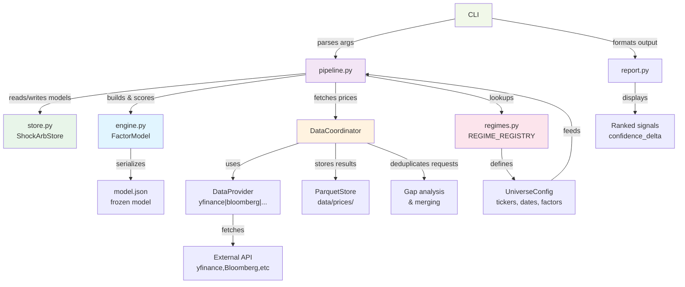

# ShockArb — Knowledge Transfer

*Updated after each session. Captures decisions and context not derivable from reading the code.  
For API details see API.md; for quick commands see CHEATSHEET.md.*

> Last updated: 2026-06-06 | Trigger: manual (\ukt) | Staleness: Fresh (session 3)

---

## What ShockArb Does

Identifies stocks mispriced by geopolitical panic selling. During a shock event the broad market, energy sector, and bond/gold complex all move in characteristic directions. ShockArb decomposes each stock's actual return into a macro-factor-explained part and a residual. A large positive residual (stock fell more than factors imply) is a mean-reversion candidate — the "ShockArb thesis".

**Primary signal:** `confidence_delta = delta_rel × r_squared`  
Sort descending, filter `r_squared > 0.50`, act on the top 5–10.

---

## Architecture — The Key Split

```
engine.py    — pure math, zero I/O. SVD + OLS. Takes DataFrames in, returns DataFrames out.
pipeline.py  — all I/O. fetch, cache, build, save, load, export, add_assets.
cli.py       — glue only. Parses args, calls pipeline/engine, formats output.
regimes.py   — regime catalogue. Adding a regime is adding a named dataclass — nothing else.
config.py    — UniverseConfig (what), ExecutionConfig (how).
cache.py     — parquet-based OHLCV caching via CacheManager.
report.py    — terminal display. print_scores, print_model_state, print_live_alpha.
store.py          — ShockArbStore: parquet file management for the datamgr coordinator.
score_history.py  — ScoreArchive: rolling daily parquet archive for regime health + alpha validation.
names.py     — ticker → company name resolution (wraps ticker_reference_cache.json).
```

**Why engine.py has zero I/O:** swapping the data source (yfinance → Bloomberg) means touching `pipeline.py` only. The math is untouched. This boundary has been deliberately enforced — don't put file reads or network calls in engine.py.

### Architecture Diagram



---

## The Build / Score Lifecycle

`build` is expensive (downloads ~35 days of calibration prices, fits SVD). Run it once per regime and save the result. `score` is cheap — it loads the frozen JSON and fetches only today's live prices.

```
build  →  save JSON  →  [days pass]  →  load JSON  →  fetch live prices  →  score
```

`shockarb score` now saves to `data/live_alpha_us.csv` by default (same file `daily_scanner.py` and `news_scanner.py` read). Use `--no-out` to suppress. Override path with `--out`.

Model files live in `data_dir` (default `./data`, override with `SHOCK_ARB_DATA_DIR`):

```
data/
├── ukraine_shock_us_20260528_143030.json         ← frozen US model (latest)
├── global_ukraine_shock_global_20260510_143055.json
├── .shockarb_regime                              ← sticky regime (one line, regime name)
├── ticker_reference_cache.json                   ← company name/industry cache
├── nyse_*.csv, nasdaq_*.csv                      ← reference data
├── live_alpha_us.csv / live_alpha_global.csv     ← daily scanner / shockarb score output
├── market_snapshot.json                          ← market_data.py output (refresh after 4pm)
├── market_report.md                              ← latest market-report (overwritten each run without --timestamp)
├── market_report_YYYYMMDD_HHMM.md               ← timestamped training-corpus copies (--timestamp flag)
├── market_report_intraday.md                     ← intraday variant
├── news.txt / fundamentals.csv                   ← news_scanner output
├── portfolio_sizer.csv                           ← portfolio_sizer default output
├── viz/                                          ← value_score_viz.py output PNGs + CSV
├── cache/                                        ← parquet OHLCV cache
└── backups/                                      ← pre-mutation parquet backups (7-day)
```

**Regime-qualified model filenames:** `build` now names files `{regime}_{universe}_{timestamp}.json` (e.g. `ukraine_shock_us_20260528_143030.json`). Legacy files named `us_*.json` still exist but are ignored when a sticky regime is set. `find_latest_model(name, exec_cfg, regime=regime.name)` must always be called with the regime argument — all five CLI commands (`score`, `export`, `show`, `add-asset`, `remove-asset`) were fixed to pass it unconditionally (not just when `--regime` is on the command line).

---

## Regimes

A regime is a `HistoricFactorModel`: a `UniverseConfig` (tickers + calibration window) plus narrative metadata. The registry is the single source of truth.

| Regime | Universe name | ETFs | Stocks | Factors | Window |
|--------|--------------|------|--------|---------|--------|
| `ukraine_shock` | `us` | 10 | 98 | 3 | 2022-02-10 → 2022-03-31 |
| `global_ukraine_shock` | `global` | 14 | 15 | 3 | 2022-02-10 → 2022-03-31 |
| `gulf_war_recovery` | `us_recovery` | 5 | 27 | 4 | 1991-03-01 → 1991-06-28 |
| `liberation_day_recovery` | `us_lib_day` | 19 | 66 | 3 | 2025-04-01 → 2025-07-31 |
| `covid_reopening` | `us_reopening` | 10 | 98 | 3 | 2020-11-09 → 2021-02-28 |

**US universe now has 98 stocks** (was 66) after bulk `add-asset` of 26 Morningstar wide-moat USD names in this session. Tickers added: NKE, FICO, LPLA, GWRE, BR, EFX, APH, OTIS, A, MKC (removed — low R²), MCD, META, BKNG, BSY, MELI, BAC, ALLE, ANET, ABNB, BMY, MDLZ, ECL, MSI, MAS, ADSK, PTC, AVGO, GOOGL. MKTX, BF-B, JKHY, DPZ, MKC removed for R² < 0.27.

**ETF basis for `ukraine_shock`:** VOO, VYM, VEU, VDE, VNQ, TLT, GLD, USO, ITA, HYG (10 ETFs, 3 factors). ITA is the defense ETF.

**Adding a new regime:** define a `HistoricFactorModel` in `regimes.py`, add it to `REGIME_REGISTRY`. No other files change. Registry now has 5 regimes; `test_regimes.py` count assertion is `== 5`.

**`covid_reopening` gotcha:** first build attempt produced T=0 (empty calibration). Root cause was a head-miss bug in `DataCoordinator._gap_analyse()` — the cache held 2022+ data and was incorrectly considered "covering" the 2020 window. Fixed by adding a `cached_start_ts > req_start_ts` head-miss check. Always verify build output shows `T > 0` before scoring.

---

## The `add-asset` / `remove-asset` Workflow

Adds/removes tickers from an existing model **without refitting**. Projects new stock onto existing factor basis via OLS.

```bash
shockarb add-asset NKE FICO META GOOGL --save
shockarb remove-asset MKC JKHY BF-B BMY DPZ MKTX --save
```

**When to use `add-asset` vs. full refit:** `add-asset` for quick scoring of new names; full `build` when you want a ticker to influence factor directions or when the universe has changed substantially.

Both commands accept multiple tickers. `remove-asset` does zero downloading — instant.

---

## Value Screener Integration

New this session. The wide-moat value screener (`morningstar051826.txt`, 119 stocks across multiple currencies) is now integrated with ShockArb factor loadings.

**Key files:**
```
morningstar051826.txt          ← raw value screener report (May 15 2026)
value_analyzer.py              ← parse, conviction score, frontier plot
utils/value_score_viz.py       ← 3-figure viz suite + combined CSV export
Knowledge Transfer_ShockArb Factor Integration and Value Frontier.md  ← design doc
```

**Conviction Score:** `(1 - P/FV) × log10(MarketCap) / Uncertainty_Penalty`

**Efficient Frontier:** upper convex hull on Conviction Score × Discount plane, trimmed to the non-dominated region (starts at max-Discount point, runs rightward). A point is *outside* if it lies on the non-origin side of any frontier segment.

**`utils/value_score_viz.py` produces:**
1. `value_scatter.png` — Conviction Score × Discount scatter. Foreign stocks = grey squares (50% alpha). USD not scored = hollow blue circles. ShockArb-scored = filled circles (positive Conf.Δ) or triangles (negative), coloured by |Conf.Δ|. Top-20 nearest/outside frontier labelled; outside points in yellow.
2. `value_factor_heatmap.png` — z-scored factor loadings (seaborn heatmap).
3. `value_etf_heatmap.png` — z-scored ETF beta loadings (loadings @ Vt).
4. `value_combined.csv` — full outer join: all 119 value screener stocks + all 66 ShockArb stocks, with `frontier_distance` (signed), `in_value`, `in_shockarb` flags, company names from NYSE/NASDAQ listings in column A.

Run: `python utils/value_score_viz.py --regime ukraine_shock --out data/viz`

**Known issue:** `value_analyzer.py` was truncated mid-session and repaired. Verify it parses correctly before use: `python value_analyzer.py morningstar051826.txt`.

---

## DataCoordinator / datamgr

`datamgr/` is a provider-agnostic data management layer. `pipeline.py` uses it via `_coordinator()` for all price fetching. The coordinator deduplicates requests, handles caching, and routes to the right provider (currently yfinance).

`datamgr/coordinator.py` is the entry point. `store.py` (in `shockarb/`) is the `ShockArbStore` implementation of the `DataStore` interface — it wraps the parquet files in `data_dir/cache/`.

---

## Test Suite

383 tests passing, 0 failing. Run with `pytest tests/ -q`.

**Note:** `test_score_history.py` requires `pyarrow` — install with `pip install pyarrow --break-system-packages` if tests fail with `ImportError`.

**New test files this session:**
- `tests/test_fundamental_scanner.py` — 26 tests for `fundamental_scanner.py` (_safe_get, _next_dividend, _next_earnings, fetch_fundamentals, print_fundamentals)
- `tests/test_portfolio_sizer.py` — 5 tests for `--exclude` flag
- `tests/test_out_flag.py` — 16 tests via `OutFileContract` / `OutDirContract` base classes; concrete subclasses for `portfolio_sizer`, `csv_to_md`, `daily_scanner`. **Pattern for new utilities:** subclass the appropriate contract, implement `invoke()`, contract tests are inherited automatically.
- `tests/test_coordinator_phase1.py` — 2 regression tests added for head-miss bug fix (`TestGapAnalyseHeadMiss`)
- `tests/test_regimes.py` — `TestCovidReopening` class (11 tests); count assertion updated to 5

Key fixture hierarchy in `conftest.py`:
- `sample_etf_returns` → 36 days × 5 ETFs, synthetic crisis structure
- `fitted_model` → `FactorModel` fitted with `n_components=2`
- `mock_model` → 3-ETF / 2-stock model saved to `temp_dir`
- `InMemoryStore` → test double for `DataStore`

---

## Utilities

```
utils/
├── daily_scanner.py        — EOD scanner; honours sticky regime; outputs live_alpha_us/global.csv
├── news_scanner.py         — headlines + fundamentals table; --out/-o saves news.txt + fundamentals.csv (default: data/)
├── fundamental_scanner.py  — yfinance fundamentals; Fwd P/E cross-check flags bad data with '?'; stale ex-div suppressed
├── portfolio_sizer.py      — conviction-weighted position sizing; saves data/portfolio_sizer.csv by default; --no-out to suppress
├── eval_picks.py           — evaluates pick P&L vs entry prices from trades.csv or portfolio_sizer.csv
├── market_data.py          — fetches market snapshot to data/market_snapshot.json (~30s); run before \mktrep
├── marketfit/              — local ShockArb-fit condition scorer (rules-based + LLM narrative)
│   ├── features.py         — pure: snapshot dict → named feature vector (vix, breadth, dispersion, etc.)
│   ├── rules.py            — pure: features → Verdict(overall, score, conditions, recommendation)
│   ├── report.py           — pure: snapshot + Verdict → Markdown report string; includes <!-- LEARN --> tags
│   ├── llm.py              — Gemini API integration; generates narrative sections keyed on LEARN tags
│   ├── model.py            — ML stub: is_usable()=False, train/predict raise NotImplementedError
│   ├── labels.py           — ML stub: label-generation design documented, not yet implemented
│   └── cli.py              — `python -m marketfit report [--snapshot] [--out] [--llm] [--timestamp]`
├── csv_to_md.py         — converts alpha CSV to markdown report
├── score_viz.py         — confidence_delta bubble chart + factor heatmap (ShockArb-only)
├── value_score_viz.py   — value screener × ShockArb 3-figure suite + combined CSV
├── maintain_ticker_cache.py — update ticker_reference_cache.json
├── data_inventory.py    — audit parquet cache coverage
├── price_check.py       — spot-check downloaded prices
├── run_backtest.py      — walk-forward backtest runner
└── score_history.py     — track signal history over time
```

**marketfit `--llm` and `--timestamp` flags (added 2026-06-06):**

- `--llm` calls `llm.py` (Gemini API) to generate narrative sections in the report. Without `--llm`, the report is rules-based only.
- `--timestamp` appends `_YYYYMMDD_HHMM` to the output filename, producing e.g. `market_report_20260606_0342.md`. Without it, overwrites `market_report.md`.
- Standard training-corpus run: `cd utils && python -m marketfit report --llm --timestamp && cd ..`
- Standard daily-view run (no corpus accumulation): `cd utils && python -m marketfit report && cd ..`

**`<!-- LEARN -->` markup scheme:**  
Report sections are bracketed by HTML comments invisible in rendered Markdown:
```
<!-- LEARN section="X" difficulty="Y" inputs="k=v,k=v" -->
...narrative text...
<!-- /LEARN -->
```
Three difficulty levels: `template` (fill-in-the-blank), `analytic` (pattern interpretation), `judgment` (holistic synthesis). The `inputs=` attribute records the exact computed values that drove the text — this is the key training signal, enabling *"given these feature values, produce this text"* learning without reverse-engineering context from prose.

Eight tagged sections in priority order: `recommendation`, `factor_signal_interpretation`, `risk_gauge_read`, `broad_market_interpretation`, `overseas_read`, `shockarb_fit_analysis`, `sector_rotation_story`, `picks_commentary`, `executive_summary`.

**Multi-vendor data plan (FMP):**  
`docs/PLAN_fmp_fundamentals.md` documents the full design for adding Financial Modeling Prep as a peer data vendor alongside yfinance. Key elements: `FundamentalsProvider` ABC in `datamgr/interfaces.py`; `datamgr/providers/fmp.py` (price) and `datamgr/providers/fmp_fundamentals.py` (fundamentals); `vendor: str = "yfinance"` in `ExecutionConfig`; env var `SHOCKARB_DATA_VENDOR` and CLI flag `--vendor fmp`. Not yet implemented — awaiting FMP API key tier decision (free=250 req/day; starter=$19/mo, 98-ticker build needs batching).

**daily_scanner.py** was fixed this session to honour the sticky regime (calls `_get_sticky_regime()` from cli.py) so it loads the same model as `shockarb score`.

---

## Directory Structure — Current State and Proposed Cleanup

The tree as of 2026-06-06 shows three categories of clutter. This section documents the proposed reorganisation; execute it whenever a clean session is available.

### Root-level loose files (move or delete)

| File | Action | Destination |
|------|--------|-------------|
| `check_1991.py` | Move | `msc/` |
| `explain_score.py` | Move | `msc/` |
| `load_tickers.py` | Move | `msc/` |
| `peek_manifest.py` | Move | `msc/` |
| `value_analyzer.py` | Move | `utils/` |
| `test_cli_regime_additions.py` | Move | `tests/` |
| `test_pipeline_regime_additions.py` | Move | `tests/` |
| `score_us_052826.md` | Move | `reports/` |
| `Names_deleted_052826.md` | Move | `docs/archive/` |
| `Knowledge Transfer_ShockArb Factor Integration and Value Frontier.md` | Move | `docs/` (rename to `VALUE_FRONTIER.md`) |
| `update06062026.md` | Move | `docs/archive/` after KT merge |
| `tree20260606.txt` | Delete | (temp file) |
| `morningstar051826.txt` | Move | `docs/archive/` |

### `data/` — market report proliferation

Multiple `market_report*.md` files accumulate at `data/` root. Create `data/reports/` and move all `market_report_*.md` timestamped files there. Keep `market_report.md` at `data/` as the "latest" symlink convention (overwritten without `--timestamp`). Update `marketfit/cli.py` `--out` default accordingly, or use `--out data/reports/market_report` as the corpus run target.

### `utils/data/` — duplicate output location

`utils/data/` holds `market_report.md` and `market_report060426.md` — these were produced before the `--out` flag was standardised. Now that `--out data/market_report.md` works from root, `utils/data/` should be deleted and any remaining files merged into `data/`.

### `reports/` — inconsistent naming

Eight alpha reports from March 2026 with ad-hoc names (`20260313o.md`, `20260313o1.md`, etc.). No action required urgently, but a naming standard going forward: `YYYYMMDD_description.md` (e.g. `20260313_us_close.md`). The existing files are useful as historical alpha records.

### `skills/` — workspace eval scaffolding

`skills/market-report-workspace/iteration-2/eval-*/` is development scaffolding for the market-report Cowork skill. This belongs in a separate dev/eval repo or a `skills/dev/` folder, not in the main project. Low priority; move when the skills iteration is complete.

### Proposed final root structure (aspirational)

```
shockarb_lab/
├── data/                   ← all runtime outputs and cache
│   ├── reports/            ← timestamped market_report_*.md files
│   └── (unchanged)
├── datamgr/                ← unchanged
├── docs/                   ← all documentation + plans + archive
│   ├── archive/            ← completed update*.md, old named MDs
│   └── (existing .md files)
├── examples/               ← unchanged
├── msc/                    ← diagnostic / one-off scripts
├── reports/                ← alpha reports (scored stock lists)
├── shockarb/               ← unchanged
├── skills/                 ← Cowork skill definitions only (no workspace)
├── tests/                  ← all test files (no root-level test_*.py)
├── utils/                  ← all utility scripts + marketfit/
├── scripts/                ← NEW: .bat / .sh command wrappers
├── MANIFEST.txt
├── verify_install.py
└── (no loose .py or .md files)
```

---

## Session Management — Context Window Warning

**Problem:** Claude sessions terminate abruptly when context exceeds ~1M tokens with no prior warning, losing unsaved work (e.g. the 2026-06-06 session that produced `update06062026.md`).

**Current mitigation — `update06062026.md` pattern:**  
When a session ends abruptly, Claude's final responses are saved by the user to a dated update file. The next session opens by reading that file alongside KT.md to reconstruct state. This is the fallback, not the goal.

**Proactive approach — checkpoint discipline:**  

1. **Update KT.md at natural break points**, not just at session end. After each major feature is delivered and tested, run `\ukt` immediately. Don't wait for the end of a long session.
2. **Context depth heuristic:** After ~15 major tool-call exchanges, Claude should proactively flag: *"We're deep into this session — good time to checkpoint KT.md before continuing."* This is a behavioural commitment, not automated tooling.
3. **Avoid loading large files mid-session unnecessarily.** Each Read of a multi-KB file consumes tokens. Use `offset`/`limit` when only part of a file is needed.
4. **High-risk operations last.** Schedule long research or multi-file rewrites earlier in a session, leaving KT updates and manifest generation for the end when context is tightest.

**Recovery pattern (when the warning was missed):**  
No manual copy-paste needed. Session transcripts are accessible programmatically:
1. New session: call `list_sessions` — find the overflowed session by title (e.g. "ShockArb rules-based scorer").
2. Call `read_transcript` on that session ID — returns the full conversation.
3. Read `docs/KT.md` + transcript → run `\ukt` to merge directly.
4. The `update_YYYYMMDD.md` file in root is the old fallback (manual copy); use `read_transcript` instead. If an update file exists, move it to `docs/archive/` after merging.

---

## File Integrity

`MANIFEST.txt` tracks SHA-256 prefixes for source + test files. Regenerate after code changes:
```bash
python verify_install.py --regenerate
```

---

## Known Design Debt / Limitations

- **`gulf_war_recovery` tickers are placeholders.** Not validated against real data yet.
- **Small calibration window (~35 trading days).** Single-event contamination risk. Inspect R² before trusting signals.
- **No position sizing built into core.** `portfolio_sizer.py` handles this as a utility.
- **`liberation_day_recovery` end date `2025-07-31`** — window may now be complete; update once normalization is confirmed.
- **Value screener ticker mapping is manual** (`VALUE_TICKER_MAP` in `value_score_viz.py`). Only 38 of 48 USD stocks are mapped; 10 unmapped names produce hollow circles with no ShockArb signal.
- **`value_score_viz.py` file truncation bug** — the sandbox Edit tool truncates files >~19KB. All repairs done via bash `head | append` pattern. If editing this file, use bash cat-to-file rather than the Edit tool.
- **`shockarb/cli.py` IndentationError at line ~738** — dangling code fragment `se_args()` and a duplicate `if args.data_dir:` block appear after `main()`. Breaks `test_cli.py` and `test_out_flag.py` collection. Needs a targeted fix before next test run against the full suite.

---

## Session Log

| Date | What changed |
|------|-------------|
| 2026-05-10 | Added `GLOBAL_UKRAINE_SHOCK` regime; fixed CLI `--universe global` deprecation; updated all docs |
| 2026-05-10 | Added `FactorModel.add_asset()`, `pipeline.add_assets()`, `add-asset` CLI subcommand |
| 2026-05-11 | Added `FactorModel.remove_asset()`, `remove-asset` CLI; 300 tests passing |
| 2026-05-27 | Fixed pervasive `hasattr(args, "regime")` bug — all 5 CLI commands now always pass regime to `find_latest_model`; fixed `daily_scanner.py` sticky regime; added `--min-confidence`/`--min-r-squared` to `score` |
| 2026-05-28 | Bulk `add-asset` of 26 wide-moat USD names from value screener; removed 6 low-R² names; US universe now 98 stocks |
| 2026-05-29 | Built value screener integration: `value_analyzer.py` (repaired), `utils/value_score_viz.py` (3-figure viz + combined CSV with signed frontier distance, membership flags, company names); efficient frontier geometry corrected to non-dominated region only |
| 2026-05-29 | Added `covid_reopening` regime; fixed head-miss bug in `DataCoordinator._gap_analyse()`; unified `--out/-o` flag across all utilities + `shockarb score`; fixed all 6 `test_cli.py` failures; added `fundamental_scanner.py` + wired into `news_scanner.py`; renamed morningstar → value throughout |
| 2026-05-30 | Archive filename changed to `YYYY-MM-DD_HHMMSS.parquet`; `load_window(days)` now counts data-days (not calendar span); multiple runs per day preserved, latest wins; `regime-health` subcommand added; industry corrections to `us_score_053026.md`; `HIL_todo.md` + `skills/hil-followup/SKILL.md` created |
| 2026-05-30 | Added `score_history.py` (`ScoreArchive`): rolling parquet archive, `save_row()`, `load_window()`, `purge_stale()`, `available_days()`, yesterday backfill; wired `--save-recent` flag into `score` subcommand; 25 new tests (`test_score_history.py`); updated API.md, CHEATSHEET.md, KT.md |
| 2026-06-01 | Added 127 tests across 4 files: `test_fundamental_scanner.py` (26), `test_portfolio_sizer.py` (5 --exclude), `test_out_flag.py` (16, OutFileContract/OutDirContract pattern), `test_coordinator_phase1.py` (2 head-miss regression), `test_regimes.py` (11 TestCovidReopening + count fix) |
| 2026-06-03 | `shockarb score` now defaults to saving `data/live_alpha_us.csv` (--no-out to suppress); `news_scanner` saves `data/news.txt` + `data/fundamentals.csv` by default; `fundamental_scanner` suppresses debug logs, filters stale ex-div dates, flags suspect P/E with `?`; `portfolio_sizer` defaults to `data/portfolio_sizer.csv`; `eval_picks.py` added |
| 2026-06-03 | Added `market-report` Cowork skill + `utils/market_data.py` fetcher; skill reads `data/market_snapshot.json` → produces `data/market_report.md` with US/overseas markets, sector sort, bonds, VIX, and ShockArb Fit Analysis; shortcuts `\mktrep` and `\market_report`; yfinance P/E cross-check and stale ex-div filter in `fundamental_scanner` |
| 2026-06-03 | Implemented `utils/marketfit/` rules-based condition scorer: `features.py` (pure feature extraction), `rules.py` (Verdict with 6 conditions + score 0–11 + recommendation), `report.py` (Markdown builder), `model.py`/`labels.py` (ML stubs, failover always active), `cli.py` (`python -m marketfit report`); 35 tests in `tests/test_marketfit.py` all passing; end-to-end smoke test produces GOOD verdict (score 7/11) against today's snapshot |
| 2026-06-06 | Added `--llm` flag to `marketfit report`: calls `utils/marketfit/llm.py` (Gemini API) to generate narrative sections; `--timestamp` flag appends `_YYYYMMDD_HHMM` to output filename for training corpus accumulation; first timestamped report `market_report_2026-06-06_0342.md` produced successfully; `<!-- LEARN section difficulty inputs -->` HTML-comment markup scheme designed for training data extraction; multi-vendor FMP plan documented in `docs/PLAN_fmp_fundamentals.md`; session ended with context overflow — state recovered from `update06062026.md`; session management / checkpoint discipline added to KT.md |
