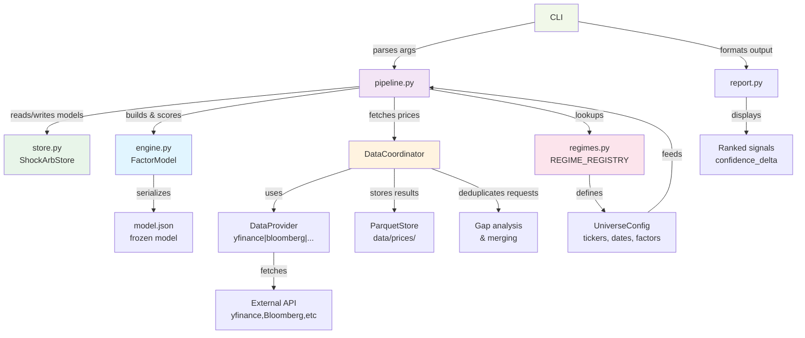

# ShockArb — Knowledge Transfer

*Updated after each session. Captures decisions and context not derivable from reading the code.  
For API details see API.md; for quick commands see CHEATSHEET.md.*

> Last updated: 2026-06-18T16:50 | Trigger: manual (\ukt) | Staleness: Fresh (session 16)

---

## Trading Preferences

**No short selling.** Ken trades only long positions. Short signals from the scanner (negative `confidence_delta`) are informational context — they identify names to *avoid* or *underweight*, not to act on. The only exception would be an extraordinarily compelling, high-conviction short case; this is expected to be a very rare occurrence.

When reviewing stock reports, short-side commentary should be surfaced only as a "names to avoid" framing, not as actionable short candidates.

---

## What ShockArb Does

Identifies stocks mispriced by geopolitical panic selling. During a shock event the broad market, energy sector, and bond/gold complex all move in characteristic directions. ShockArb decomposes each stock's actual return into a macro-factor-explained part and a residual. A large positive residual (stock fell more than factors imply) is a mean-reversion candidate — the "ShockArb thesis".

**Primary signal:** `confidence_delta = delta_rel × r_squared`  
Sort descending, filter `r_squared > 0.50`, act on the top 5–10.

---

## Architecture — The Key Split

```
engine.py    — pure math, zero I/O. SVD + OLS. Takes DataFrames in, returns DataFrames out.
pipeline.py  — all I/O. fetch, cache, build, save, load, export, add_assets.
cli.py       — glue only. Parses args, calls pipeline/engine, formats output.
regimes.py   — regime catalogue. Adding a regime is adding a named dataclass — nothing else.
config.py    — UniverseConfig (what), ExecutionConfig (how).
cache.py     — parquet-based OHLCV caching via CacheManager.
report.py    — terminal display. print_scores, print_model_state, print_live_alpha.
store.py          — ShockArbStore: parquet file management for the datamgr coordinator.
score_history.py  — ScoreArchive: rolling daily parquet archive for regime health + alpha validation.
names.py     — ticker → company name resolution (wraps ticker_reference_cache.json).
report_compare.py — compares two+ stock_report_*.md / *_verdicts.csv files (dispatch by extension);
                     ticker x report tier/stat comparison + tier-mismatch flagging; `compare-reports` CLI.
```

**Why engine.py has zero I/O:** swapping the data source (yfinance → Bloomberg) means touching `pipeline.py` only. The math is untouched. This boundary has been deliberately enforced — don't put file reads or network calls in engine.py.

### Architecture Diagram



---

## The Build / Score Lifecycle

`build` is expensive (downloads ~35 days of calibration prices, fits SVD). Run it once per regime and save the result. `score` is cheap — it loads the frozen JSON and fetches only today's live prices.

```
build  →  save JSON  →  [days pass]  →  load JSON  →  fetch live prices  →  score
```

`shockarb score` now saves to `data/live_alpha_us.csv` by default (same file `daily_scanner.py` and `news_scanner.py` read). Use `--no-out` to suppress. Override path with `--out`.

Model files live in `data_dir` (default `./data`, override with `SHOCK_ARB_DATA_DIR`):

```
data/
├── ukraine_shock_us_20260528_143030.json         ← frozen US model (latest)
├── global_ukraine_shock_global_20260510_143055.json
├── .shockarb_regime                              ← sticky regime (one line, regime name)
├── ticker_reference_cache.json                   ← company name/industry cache
├── nyse_*.csv, nasdaq_*.csv                      ← reference data
├── live_alpha_us.csv / live_alpha_global.csv     ← daily scanner / shockarb score output
├── market_snapshot.json                          ← market_data.py output (refresh after 4pm)
├── news.txt / fundamentals.csv                   ← news_scanner output
├── portfolio_sizer.csv                           ← portfolio_sizer default output
├── viz/                                          ← value_score_viz.py output PNGs + CSV
├── cache/                                        ← parquet OHLCV cache
└── backups/                                      ← pre-mutation parquet backups (7-day)

reports/                                          ← generated Markdown reports (project root)
├── market_report.md                              ← latest market report (overwritten without --timestamp)
├── market_report_YYYYMMDD_HHMM.md               ← timestamped archive (--timestamp flag)
├── market_report_intraday.md                     ← intraday variant
├── stock_report.md                               ← latest stock opportunity report
└── stock_report_YYYYMMDD_HHMM.md                ← timestamped archive (--timestamp flag)
```

**Regime-qualified model filenames:** `build` now names files `{regime}_{universe}_{timestamp}.json` (e.g. `ukraine_shock_us_20260528_143030.json`). Legacy files named `us_*.json` still exist but are ignored when a sticky regime is set. `find_latest_model(name, exec_cfg, regime=regime.name)` must always be called with the regime argument — all five CLI commands (`score`, `export`, `show`, `add-asset`, `remove-asset`) were fixed to pass it unconditionally (not just when `--regime` is on the command line).

---

## Regimes

A regime is a `HistoricFactorModel`: a `UniverseConfig` (tickers + calibration window) plus narrative metadata. The registry is the single source of truth.

| Regime | Universe name | ETFs | Stocks | Factors | Window |
|--------|--------------|------|--------|---------|--------|
| `ukraine_shock` | `us` | 10 | 98 | 3 | 2022-02-10 → 2022-03-31 |
| `global_ukraine_shock` | `global` | 14 | 15 | 3 | 2022-02-10 → 2022-03-31 |
| `gulf_war_recovery` | `us_recovery` | 5 | 27 | 4 | 1991-03-01 → 1991-06-28 |
| `liberation_day_recovery` | `us_lib_day` | 19 | 66 | 3 | 2025-04-01 → 2025-07-31 |
| `covid_reopening` | `us_reopening` | 10 | 98 | 3 | 2020-11-09 → 2021-02-28 |
| `iran_shock` | `us_iran` | 19 | 80 | 3 | 2026-02-24 → 2026-04-30 |
| `iran_extended` | `us_iran_ext` | 19 | 80 | 3 | 2026-02-24 → 2026-06-15 |

**US universe now has 98 stocks** (was 66) after bulk `add-asset` of 26 Morningstar wide-moat USD names in this session. Tickers added: NKE, FICO, LPLA, GWRE, BR, EFX, APH, OTIS, A, MKC (removed — low R²), MCD, META, BKNG, BSY, MELI, BAC, ALLE, ANET, ABNB, BMY, MDLZ, ECL, MSI, MAS, ADSK, PTC, AVGO, GOOGL. MKTX, BF-B, JKHY, DPZ, MKC removed for R² < 0.27.

**ETF basis for `ukraine_shock`:** VOO, VYM, VEU, VDE, VNQ, TLT, GLD, USO, ITA, HYG (10 ETFs, 3 factors). ITA is the defense ETF. **(Stale — session 16):** the active saved model `data/ukraine_shock_us_20260617_211317.json` actually carries a **19-ETF** basket identical to `iran_shock`'s (`VOO, VYM, VUG, VEU, VDE, VNQ, TLT, GLD, USO, ITA, XLB, XLI, XLK, XLP, XLY, XLF, XLV, XLU, HYG`); the "10 ETFs" figure here and in the Regimes table is out of date for the current model. Confirm whether `regimes.py` was updated to 19 or the model was rebuilt under a different universe. *(This shared 19-ETF ambient space is what makes the cross-regime subspace comparison well-defined — see `docs/SUBSPACE_DISLOCATION.md`.)*

**Adding a new regime:** define a `HistoricFactorModel` in `regimes.py`, add it to `REGIME_REGISTRY`. No other files change except `test_regimes.py` count assertion. Registry now has **7 regimes** (added `iran_extended` in session 15 — extends iran_shock calibration window to 2026-06-15 to capture full conflict + normalization phase; `supersedes="iran_shock"`); `test_regimes.py` count assertion is `== 7`.

**Regime selection guidance (2026-06-18):** `ukraine_shock` is NOT obsolete during the Iran conflict. Its calibration (Feb–Mar 2022) captured how tech/software stocks correlate with macro factors during a broad geopolitical risk-off, which is structurally stable. `iran_shock` (calibrated on energy/defense/Strait factors) has low r² for tech names (MSFT r²=0.60, CRM r²=0.32) and is the right lens for energy, defense, and industrial names. **Recommended dual-regime workflow:** score both, compare with `compare-reports --save-verdicts`, act on names where both agree. Cross-regime agreement on direction = higher conviction. ASML is the clearest short signal (both regimes agree, iran r²=0.67). MSFT is the clearest long (both agree, iran r²=0.60). **`iran_extended`** (added session 15) extends calibration to 2026-06-15 to refit on the full conflict + normalization phase — likely improves r² for tech names. Run `shockarb build --regime iran_extended` before scoring with it. **Regime combination/selection — resolved (session 16).** The "ML/XGBoost regime-selection (Opus-level task)" item is closed. Chosen approach is geometric, not supervised ML: work with the two regimes' factor **subspaces** (Grassmannian), since ShockArb's signal `r − Π_H r` is a projection quantity invariant to eigenvector rotation/flip. Combine = residual orthogonal to the union `S_u + S_i`; select = attribute `r²_u − r²_i` to the symmetric-difference directions (iran-only ≈ energy/Strait); bias-correct `r²` via factor_lab's James–Stein projection `H D_ψ⁻¹ Hᵀ` (raw `r²` is dispersion-biased low, worst at the `r²>0.50` gate). XGBoost demoted to an optional thin weight-emitting selector; Kalman demoted (two-stream blend not worth it; time-varying loadings, if ever wanted, should be subspace tracking, not `β_t` tracking — no basis anchoring needed). Full design: `docs/SUBSPACE_DISLOCATION.md`; reasoning + rejected alternatives: `docs/Opus_KT.md`; information/coding-theory framing + a CUSUM regime-switch direction: `docs/channel_KT.md`.

**`covid_reopening` gotcha:** first build attempt produced T=0 (empty calibration). Root cause was a head-miss bug in `DataCoordinator._gap_analyse()` — the cache held 2022+ data and was incorrectly considered "covering" the 2020 window. Fixed by adding a `cached_start_ts > req_start_ts` head-miss check. Always verify build output shows `T > 0` before scoring.

---

## The `add-asset` / `remove-asset` Workflow

Adds/removes tickers from an existing model **without refitting**. Projects new stock onto existing factor basis via OLS.

```bash
shockarb add-asset NKE FICO META GOOGL --save
shockarb remove-asset MKC JKHY BF-B BMY DPZ MKTX --save
```

**When to use `add-asset` vs. full refit:** `add-asset` for quick scoring of new names; full `build` when you want a ticker to influence factor directions or when the universe has changed substantially.

Both commands accept multiple tickers. `remove-asset` does zero downloading — instant.

---

## Value Screener Integration

New this session. The wide-moat value screener (`morningstar051826.txt`, 119 stocks across multiple currencies) is now integrated with ShockArb factor loadings.

**Key files:**
```
morningstar051826.txt          ← raw value screener report (May 15 2026)
value_analyzer.py              ← parse, conviction score, frontier plot
utils/value_score_viz.py       ← 3-figure viz suite + combined CSV export
Knowledge Transfer_ShockArb Factor Integration and Value Frontier.md  ← design doc
```

**Conviction Score:** `(1 - P/FV) × log10(MarketCap) / Uncertainty_Penalty`

**Efficient Frontier:** upper convex hull on Conviction Score × Discount plane, trimmed to the non-dominated region (starts at max-Discount point, runs rightward). A point is *outside* if it lies on the non-origin side of any frontier segment.

**`utils/value_score_viz.py` produces:**
1. `value_scatter.png` — Conviction Score × Discount scatter. Foreign stocks = grey squares (50% alpha). USD not scored = hollow blue circles. ShockArb-scored = filled circles (positive Conf.Δ) or triangles (negative), coloured by |Conf.Δ|. Top-20 nearest/outside frontier labelled; outside points in yellow.
2. `value_factor_heatmap.png` — z-scored factor loadings (seaborn heatmap).
3. `value_etf_heatmap.png` — z-scored ETF beta loadings (loadings @ Vt).
4. `value_combined.csv` — full outer join: all 119 value screener stocks + all 66 ShockArb stocks, with `frontier_distance` (signed), `in_value`, `in_shockarb` flags, company names from NYSE/NASDAQ listings in column A.

Run: `python utils/value_score_viz.py --regime ukraine_shock --out data/viz`

**Known issue:** `value_analyzer.py` was truncated mid-session and repaired. Verify it parses correctly before use: `python value_analyzer.py morningstar051826.txt`.

---

## DataCoordinator / datamgr

`datamgr/` is a provider-agnostic data management layer. `pipeline.py` uses it via `_coordinator()` for all price fetching. The coordinator deduplicates requests, handles caching, and routes to the right provider (currently yfinance).

`datamgr/coordinator.py` is the entry point. `store.py` (in `shockarb/`) is the `ShockArbStore` implementation of the `DataStore` interface — it wraps the parquet files in `data_dir/cache/`.

---

## Test Suite

**`test_stockfit.py` + `test_stockfit_rvol.py` + `test_marketfit.py`: all passing.** Run with:
```bash
PYTHONPYCACHEPREFIX=/tmp/shockarb_pycache python -m pytest tests/test_stockfit.py tests/test_stockfit_rvol.py tests/test_marketfit.py -v
```

**Full suite (2026-06-12, session 13): `pytest tests/ -q` — 652/657 passing**, across 21 test files (up from 616/616 across 18 — added `tests/test_report_compare.py`, 21 tests). The 5 failures are pre-existing and unrelated (`TestSyntheticPrices`/`TestAddAssets` in `test_pipeline.py`). (The earlier "372 passing, 49 failing" figure was specific to a transient pre-RVOL state and is no longer current.)

**Running subsets:** use `scripts\run_tests.bat <group>` instead of memorising file lists — e.g. `scripts\run_tests.bat rvol`, `scripts\run_tests.bat stockfit -v`, `scripts\run_tests.bat all -k rvol`. Run `scripts\run_tests.bat help` for the full group list (stockfit, rvol, marketfit, report, cli, engine, pipeline, regimes, cache, config, portfolio, fundamentals, all).

**`PYTHONPYCACHEPREFIX` workaround:** The Linux sandbox mount of the Windows NTFS project folder does not reflect file mtime updates made via the file Edit tool. Python's `.pyc` cache reads the stale mtime, bypasses the updated source, and runs old bytecode. Setting `PYTHONPYCACHEPREFIX=/tmp/fresh_dir` redirects the pyc cache to a directory where no stale files exist, forcing recompilation from the current source. Required whenever tests fail with `???` instead of a real source line in the traceback.

**Note:** `test_score_history.py` requires `pyarrow` — install with `pip install pyarrow --break-system-packages` if tests fail with `ImportError`.

**Test files by package:**
- `tests/test_stockfit.py` — 128 tests across 7 classes: `TestFeatureExtraction` (11), `TestRulesEngine` (13), `TestClusterAnnotation` (4), `TestReportBuild` (18), `TestReportEnhanced` (10), `TestCliResolveOut` (5), `TestCliLoaders` (8; uses `tmp_path` for synthetic file I/O)
- `tests/test_stockfit_rvol.py` — 21 tests across 5 classes: `TestComputeRvol` (6), `TestExtractAllRvol` (2), `TestStockVerdictRvol` (4), `TestReportRvolColumn` (2), `TestStickyRvolCli` (7)
- `tests/test_stockfit_intraday.py` — 14 tests across 4 classes: `TestFetchIntradayPrices` (5), `TestExtractAllIntraday` (3), `TestStockVerdictIntraday` (4), `TestReportIntradayColumn` (2)
- `tests/test_marketfit.py` — extended with `TestCliLoaders` (9 tests): `_load_news`, `_load_picks`, `_load_fundamentals`, `_is_stale`
- `tests/test_fundamental_scanner.py` — 36 tests for `fundamental_scanner.py` (added `TestLoadOverrides` 6 tests + `TestFetchFundamentalsOverrides` 3 tests + `TestStockfitDebugFlag` 1 test)
- `tests/test_portfolio_sizer.py` — 10 tests: `TestExclude` (5), `TestTickers` (5 — covers bypass of ranking, `--top` override, case-insensitivity, weight normalisation, unknown-ticker skip)
- `tests/test_out_flag.py` — 16 tests via `OutFileContract` / `OutDirContract` base classes; **pattern for new utilities:** subclass the appropriate contract, implement `invoke()`, contract tests are inherited automatically
- `tests/test_coordinator_phase1.py` — 2 regression tests for head-miss bug fix (`TestGapAnalyseHeadMiss`)
- `tests/test_regimes.py` — `TestCovidReopening` class (11 tests); count assertion updated to 5
- `tests/test_report_compare.py` — 21 tests covering `_clean_number`/`_to_float`, `parse_report` dispatch (`.md` and `.csv` verdicts), `build_comparison` (union of tickers + tier-mismatch flagging), `_interesting_tickers`, `print_comparison`, and `write_comparison_md` (including `fwd_pe` from verdicts CSV and exclusion `reason` for flagged tickers)

Key fixture hierarchy in `conftest.py`:
- `sample_etf_returns` → 36 days × 5 ETFs, synthetic crisis structure
- `fitted_model` → `FactorModel` fitted with `n_components=2`
- `mock_model` → 3-ETF / 2-stock model saved to `temp_dir`
- `InMemoryStore` → test double for `DataStore`

---

## Utilities

```
utils/
├── paths.py                — canonical path registry; all pipeline paths as relative Path objects; no str() casts anywhere; see docs/PATHS.md
├── daily_scanner.py        — EOD scanner; honours sticky regime; outputs live_alpha_us/global.csv
├── news_scanner.py         — headlines + fundamentals table; --out/-o saves news.txt + fundamentals.csv (default: data/)
├── fundamental_scanner.py  — yfinance fundamentals; Fwd P/E cross-check flags bad data with '?'; stale ex-div suppressed;
│                             analyst targets overridden by data/analyst_overrides.csv (always wins; blank rows skipped)
├── portfolio_sizer.py      — conviction-weighted position sizing; --tickers AMAT ADI ETN sizes only named tickers (bypasses CSV ranking); --exclude for ad-hoc drops; saves data/portfolio_sizer.csv by default; --no-out to suppress
├── eval_picks.py           — evaluates pick P&L vs entry prices from trades.csv or portfolio_sizer.csv
get_analyst_targets.py      — fetches consensus analyst price targets; default provider: Finviz (no API key); also supports yfinance, FMP, Finnhub; lives in project root; output: {provider}_analyst_data.csv
├── market_data.py          — fetches market snapshot to data/market_snapshot.json (~30s); run before \mktrep
├── marketfit/              — local ShockArb-fit condition scorer (rules-based + LLM narrative)
│   ├── features.py         — pure: snapshot dict → named feature vector (vix, breadth, dispersion, etc.)
│   ├── rules.py            — pure: features → Verdict(overall, score, conditions, recommendation)
│   ├── report.py           — pure: snapshot + Verdict → Markdown report string; includes <!-- LEARN --> tags
│   ├── llm.py              — Gemini API integration; generates narrative sections keyed on LEARN tags
│   ├── model.py            — ML stub: is_usable()=False, train/predict raise NotImplementedError
│   ├── labels.py           — ML stub: label-generation design documented, not yet implemented
│   └── cli.py              — `python -m marketfit report [--snapshot] [--out] [--no-llm] [--timestamp]`
├── stockfit/               — per-ticker stock opportunity report (parallel to marketfit)
│   ├── features.py         — pure: live_alpha_us.csv + fundamentals.csv + news.txt → per-ticker feature dicts; optional intraday quote fetch
│   ├── rules.py            — pure: features → StockVerdict (INCLUDE / WATCH / EXCLUDE) with reason + cluster annotation
│   ├── report.py           — pure: verdicts → Markdown report string with <!-- LEARN --> tags per ticker; table includes RVOL + Intraday columns
│   ├── llm.py              — Anthropic/Gemini client; generates per-ticker narrative + executive summary
│   └── cli.py              — `python -m stockfit {report,set-rvol,show-rvol}`; report flags: `[--no-llm] [--timestamp] [--min-r2] [--min-confidence] [--min-upside] [--reports-dir] [--rvol] [--no-rvol] [--intraday]`
├── csv_to_md.py         — converts alpha CSV to markdown report
├── score_viz.py         — confidence_delta bubble chart + factor heatmap (ShockArb-only)
├── value_score_viz.py   — value screener × ShockArb 3-figure suite + combined CSV
├── maintain_ticker_cache.py — update ticker_reference_cache.json
├── data_inventory.py    — audit parquet cache coverage
├── price_check.py       — spot-check downloaded prices
├── run_backtest.py      — walk-forward backtest runner
└── score_history.py     — track signal history over time
```

**stockfit — per-ticker stock opportunity report (added 2026-06-06):**

Parallel to `marketfit` but operates on stock signals rather than macro conditions. Reads the three pipeline output files that already exist after a normal EOD run; no new data fetching required.

- `features.py` extracts one feature dict per ticker: signal quality (r², confidence_delta, delta_rel), fundamentals (price, analyst_target, fwd_pe, next_earnings), catalyst news, and derived flags (`target_below_price`, `earnings_imminent`).
- `rules.py` applies deterministic gates in order: data quality (target_below_price → hard EXCLUDE) → earnings (imminent → EXCLUDE) → signal strength (r² ≥ 0.65, confidence_delta ≥ 0.020) → analyst upside (≥ 5% for INCLUDE; below threshold → WATCH). Annotates INCLUDE tickers that share a sector cluster (e.g. ≥2 semiconductor equipment names → cluster-risk warning added).
- `report.py` assembles a three-section Markdown report: `✅ Act on These` (INCLUDE, per-ticker LEARN block), `⚠️ Watch`, `❌ Excluded` (table with reason), plus `📌 Data Quality Flags`.
- `llm.py` reuses the same Anthropic/Gemini backend pattern as `marketfit/llm.py`. Produces: `executive_summary`, `picks_analysis` (nested dict of per-ticker narratives), `watch_list_notes`, `risk_factors`.
- CLI: `cd utils && python -m stockfit report [--no-llm] [--timestamp] [--min-r2 0.65] [--min-confidence 0.020] [--min-upside 0.05] [--rvol] [--no-rvol] [--intraday]`. LLM is ON by default. Output: `data/stock_report.md` or `data/stock_report_YYYYMMDD_HHMM.md`.

Smoke-test result (2026-06-06): 3 INCLUDE (AMAT, ADI, ETN), 2 WATCH (LRCX, ASML), 61 EXCLUDE. KLAC and QCOM correctly excluded via data-quality gate.

**RVOL (relative volume) display (added 2026-06-11):**

Informational/display-only column (Option #1 of the RVOL design discussion) — does not affect scoring, ranking, gating, or the PCA factor model. RVOL = most recent cached day's volume / trailing average volume, dynamic 5-20 day window (`RVOL_MIN_WINDOW`/`RVOL_MAX_WINDOW` in `stockfit/features.py`), shown as e.g. `2.3x (10d)` or `—` if cache history is insufficient. Computed from the local DataStore parquet cache only — no network calls.

Off by default. Enable per-run with `python -m stockfit report --rvol` (or `--no-rvol` to force off). Persist a preference across runs with `python -m stockfit set-rvol on` / `set-rvol off`; check the current sticky setting with `python -m stockfit show-rvol`. The sticky file is `data/.stockfit_rvol` (`STOCKFIT_RVOL_FILE` in `paths.py`), mirroring `shockarb`'s `.shockarb_regime` pattern. Resolution order: `--rvol`/`--no-rvol` flag > sticky file > default off. See `docs/PATHS.md` ("Sticky CLI State") for the path/file convention and `tests/test_stockfit_rvol.py` for the full test coverage.

**Intraday price/% change display (added 2026-06-11, session 12):**

Informational/display-only column, mirroring marketfit's `_fetch_intraday_current` design — does not affect scoring, ranking, or gating. `features._fetch_intraday_prices(tickers)` makes a single batch `yf.download(tickers, period="1d", auto_adjust=True)` call and returns `{ticker: last_close_price}` (or `{}` on failure/empty/no tickers — network errors degrade gracefully). `extract_all(..., compute_intraday=True)` populates `intraday_price` and `intraday_chg_pct = (intraday_price - price) / price` per ticker; the report table's Intraday column shows `+x.xx%` or `—` if unavailable.

Off by default, no sticky setting (unlike RVOL) — enable per-run with `python -m stockfit report --intraday`. This is a network call. See `tests/test_stockfit_intraday.py` for full coverage.

**`--save-verdicts` — durable full-stat CSV (added 2026-06-12):**

Problem: `report.build()` only writes full per-ticker stats (r², confidence_delta, upside, price, target, fwd P/E, etc.) for INCLUDE/WATCH tickers — the `❌ Excluded` table keeps only a `reason` string. `data/live_alpha_us.csv` is overwritten by every `shockarb score` run, so once a report is generated, the EXCLUDE-tier stats for that run are gone for good.

`python -m stockfit report --save-verdicts` writes `<report>_verdicts.csv` alongside the `.md` (e.g. `stock_report_20260612_0800.md` → `stock_report_20260612_0800_verdicts.csv`), one row per ticker for ALL tiers. Columns: `VERDICT_CSV_FIELDS` in `stockfit/rules.py` — `ticker, tier, reason, r_squared, confidence_delta, analyst_upside, price, analyst_target, fwd_pe, cluster, rvol, rvol_window, intraday_price, intraday_chg_pct, news_headlines, warnings` (list fields joined with `"; "`). Serialization helper: `rules.verdicts_to_rows()`. Path derivation: `cli._verdicts_path()`.

Off by default (opt-in, avoids file proliferation). A natural pairing is `--timestamp --save-verdicts` so the CSV survives alongside the archived `.md`. **Resolved (session 13):** `shockarb.report_compare` now reads these CSVs via `parse_report`'s `.csv` dispatch (`_parse_verdicts_csv`), enabling full-stat cross-report comparison — see below. See `tests/test_stockfit.py::TestVerdictsCsv` and `::TestCliVerdictsPath`.

**`shockarb.report_compare` / `compare-reports` CLI (added 2026-06-12, session 13):**

Compares two or more reports — any mix of `stock_report_*.md` and `stock_report_*_verdicts.csv` — and highlights where tickers' tiers or stats diverge across regimes/dates. `parse_report(path)` dispatches on extension via `_PARSERS` (`.md → _parse_report_md`, `.csv → _parse_verdicts_csv`) into a common `ReportData`. `build_comparison(reports)` returns a ticker × report `MultiIndex` DataFrame (`COMPARISON_FIELDS = ["tier", "r_squared", "conf_delta", "upside", "fwd_pe", "reason"]`) plus a `flagged` Series for tier mismatches. `_interesting_tickers()` selects tickers that are act_on/watch in *any* report, or flagged — tickers excluded consistently everywhere are omitted from the Stats sections. `print_comparison()` and `write_comparison_md()` render the tier table + per-report Stats (including `fwd_pe` and the exclusion `reason`, useful for judging which regime's factor model currently fits a ticker better). CLI: `python -m shockarb compare-reports <reportA> <reportB> [...] [--out compare.md]`. 21 tests in `tests/test_report_compare.py`. Documented in `docs/API.md` (new module section) and `docs/CHEATSHEET.md` ("Comparing Reports Across Regimes/Dates").

**Full EOD workflow (5 steps):**
```
shockarb score                                              → data/live_alpha_us.csv
python utils\news_scanner.py                                → data/fundamentals.csv + news.txt
python utils\market_data.py                                 → data/market_snapshot.json
python -m marketfit report --timestamp                              → reports/market_report_YYYYMMDD_HHMM.md  (LLM on by default)
python -m stockfit report --timestamp                               → reports/stock_report_YYYYMMDD_HHMM.md   (LLM on by default)
```
Or: `scripts\shockarb_workflows.bat dual_eod` (recommended — scores both regimes + auto-compares).
Or: `scripts\shockarb_workflows.bat eod` (single regime, also aliased as `full`).

**marketfit/stockfit LLM and `--timestamp` flags:**

- LLM is ON by default (session 14). Use `--no-llm` for a fast rules-based report.
- `--timestamp` appends `_YYYYMMDD_HHMM` to the output filename, producing e.g. `market_report_20260606_0342.md`. Without it, overwrites `market_report.md`.
- Standard training-corpus run: `python -m marketfit report --timestamp` (no flag needed)
- Fast rules-based run: `python -m marketfit report --no-llm`

**`<!-- LEARN -->` markup scheme:**  
Report sections are bracketed by HTML comments invisible in rendered Markdown:
```
<!-- LEARN section="X" difficulty="Y" inputs="k=v,k=v" -->
...narrative text...
<!-- /LEARN -->
```
Three difficulty levels: `template` (fill-in-the-blank), `analytic` (pattern interpretation), `judgment` (holistic synthesis). The `inputs=` attribute records the exact computed values that drove the text — this is the key training signal, enabling *"given these feature values, produce this text"* learning without reverse-engineering context from prose.

Eight tagged sections in priority order: `recommendation`, `factor_signal_interpretation`, `risk_gauge_read`, `broad_market_interpretation`, `overseas_read`, `shockarb_fit_analysis`, `sector_rotation_story`, `picks_commentary`, `executive_summary`.

**Multi-vendor data plan (FMP):**  
`docs/PLAN_fmp_fundamentals.md` documents the full design for adding Financial Modeling Prep as a peer data vendor alongside yfinance. Key elements: `FundamentalsProvider` ABC in `datamgr/interfaces.py`; `datamgr/providers/fmp.py` (price) and `datamgr/providers/fmp_fundamentals.py` (fundamentals); `vendor: str = "yfinance"` in `ExecutionConfig`; env var `SHOCKARB_DATA_VENDOR` and CLI flag `--vendor fmp`. Not yet implemented — awaiting FMP API key tier decision (free=250 req/day; starter=$19/mo, 98-ticker build needs batching).

**daily_scanner.py** was fixed this session to honour the sticky regime (calls `_get_sticky_regime()` from cli.py) so it loads the same model as `shockarb score`.

---

## Directory Structure — Current State

Reorganisation completed 2026-06-06 (session 5). Root is clean; all loose files have been moved.

```
shockarb_lab/
├── data/                   ← runtime model artefacts, scores, and cache
│   ├── cache/              ← parquet OHLCV cache
│   ├── backups/            ← pre-mutation parquet backups (7-day)
│   ├── viz/                ← value_score_viz.py output PNGs + CSV
│   ├── .shockarb_regime    ← sticky regime (one line, regime name)
│   └── .stockfit_rvol      ← sticky RVOL display setting (on/off, see PATHS.md)
├── datamgr/                ← provider-agnostic data management layer
├── docs/                   ← all documentation + plans
│   ├── archive/            ← update06062026.md, Names_deleted_052826.md,
│   │                          score_us_052826.md, morningstar051826.txt,
│   │                          ticker_news.md, news.txt (root copy)
│   ├── corpus/             ← corpus_pack_1-4.txt, doc_1-4.txt (training bundles)
│   ├── KT.md               ← this file
│   ├── RAG_DESIGN.md       ← design doc for local RAG retrieval system (session 15)
│   └── VALUE_FRONTIER.md   ← renamed from "Knowledge Transfer_ShockArb..."
├── examples/               ← unchanged
├── msc/                    ← diagnostic/one-off scripts
│   │                          (check_1991.py, explain_score.py, load_tickers.py, peek_manifest.py)
├── reports/                ← generated Markdown reports (market_report, stock_report — default CLI output)
│   ├── stock_report_YYYYMMDD_HHMM.md  ← timestamped ukraine_shock reports
│   └── iran_shock/         ← iran_shock-specific reports (pass --reports-dir reports\iran_shock)
├── scripts/                ← .bat / .sh command wrappers (shockarb_workflows.bat,
│                              run_tests.bat — file-based pytest subset runner,
│                              session_log.py — LLM session summarizer from shockarb.log)
├── shockarb/               ← core package
├── skills/                 ← Cowork skill definitions (market-report-workspace eval scaffolding
│                              still here; low priority to move)
├── tests/                  ← all test files (test_cli_regime_additions.py +
│                              test_pipeline_regime_additions.py moved from root)
├── utils/                  ← utility scripts + marketfit/ + stockfit/
│   ├── paths.py            ← canonical path registry (relative Path objects; see docs/PATHS.md)
│   └── value_analyzer.py   ← moved from root
├── MANIFEST.txt
├── generate_manifest.py
└── verify_install.py
```

**Remaining root clutter (Windows file lock — cannot delete from sandbox):**  
`tree20260606.txt`, `tree.txt`, `jsontree.txt`, `debug_out.txt` — delete manually from Windows Explorer or a local terminal.

**`reports/` naming note:** Eight alpha reports from March 2026 use ad-hoc names (`20260313o.md`, etc.). Going forward use `YYYYMMDD_description.md`. Existing files are valid historical records.

---

## Session Management — Context Window Warning

**Problem:** Claude sessions terminate abruptly when context exceeds ~1M tokens with no prior warning, losing unsaved work (e.g. the 2026-06-06 session that produced `update06062026.md`).

**Current mitigation — `update06062026.md` pattern:**  
When a session ends abruptly, Claude's final responses are saved by the user to a dated update file. The next session opens by reading that file alongside KT.md to reconstruct state. This is the fallback, not the goal.

**Proactive approach — checkpoint discipline:**  

1. **Update KT.md at natural break points**, not just at session end. After each major feature is delivered and tested, run `\ukt` immediately. Don't wait for the end of a long session.
2. **Context depth heuristic:** After ~15 major tool-call exchanges, Claude should proactively flag: *"We're deep into this session — good time to checkpoint KT.md before continuing."* This is a behavioural commitment, not automated tooling.
3. **Avoid loading large files mid-session unnecessarily.** Each Read of a multi-KB file consumes tokens. Use `offset`/`limit` when only part of a file is needed.
4. **High-risk operations last.** Schedule long research or multi-file rewrites earlier in a session, leaving KT updates and manifest generation for the end when context is tightest.

**Recovery pattern (when the warning was missed):**  
No manual copy-paste needed. Session transcripts are accessible programmatically:
1. New session: call `list_sessions` — find the overflowed session by title (e.g. "ShockArb rules-based scorer").
2. Call `read_transcript` on that session ID — returns the full conversation.
3. Read `docs/KT.md` + transcript → run `\ukt` to merge directly.
4. The `update_YYYYMMDD.md` file in root is the old fallback (manual copy); use `read_transcript` instead. If an update file exists, move it to `docs/archive/` after merging.

---

## File Integrity

`MANIFEST.txt` tracks SHA-256 prefixes (CRLF-normalised, hash-of-hashes bundle)
for all `.py` files under `shockarb/`, `utils/`, `datamgr/`, `tests/`, plus
`scripts/*.bat`, `verify_install.py`, and `generate_manifest.py` itself
(90 files as of session 15, bundle `4012091a2f8a66582692af20` — added `scripts/session_log.py` and changes to `regimes.py`, both CLIs, `portfolio_sizer.py`, `shockarb_workflows.bat`). Regenerate after code changes, then verify:
```bash
python generate_manifest.py
python verify_install.py
```

---

## Known Design Debt / Limitations

- **`gulf_war_recovery` tickers are placeholders.** Not validated against real data yet.
- **Small calibration window (~35 trading days).** Single-event contamination risk. Inspect R² before trusting signals.
- **No position sizing built into core.** `portfolio_sizer.py` handles this as a utility. Note: ALLOCATION column = target dollar amount; SHARES = floor(alloc/price); actual deployment will be less due to whole-share rounding (~$700 undeployed on $10k for 2-stock ticket).
- ~~**`portfolio_sizer.py` missing `_check_cwd()`**~~ — resolved session 15; `_check_cwd()` added, checks `Path("data").is_dir()` (project root).
- **`liberation_day_recovery` end date `2025-07-31`** — window may now be complete; update once normalization is confirmed.
- **Value screener ticker mapping is manual** (`VALUE_TICKER_MAP` in `value_score_viz.py`). Only 38 of 48 USD stocks are mapped; 10 unmapped names produce hollow circles with no ShockArb signal.
- **`value_score_viz.py` file truncation bug** — the sandbox Edit tool truncates files >~19KB. All repairs done via bash `head | append` pattern. If editing this file, use bash cat-to-file rather than the Edit tool.
- ~~**`shockarb/cli.py` IndentationError at line ~738**~~ — resolved; full suite (593/593, including `test_cli.py` and `test_out_flag.py`) passes as of 2026-06-11 (session 11).
- **LLM company-name hallucination** — Gemini confuses tickers with wrong companies (e.g. CPRT → "Coinpair" instead of Copart Inc.). Root cause: `_build_prompt()` in `stockfit/llm.py` sends only `[TICKER]` with no company name; Gemini guesses from training data. Fix: inject `resolve_name(ticker)` from `shockarb/names.py` (wraps `ticker_reference_cache.json`) into the prompt block as `[CPRT — Copart, Inc.]`. Same fix needed in `marketfit/llm.py`. **Not yet implemented.**
- **Bash sandbox mount can serve stale/corrupted content for files NOT touched this session** — recurs across sessions, not limited to recently-edited files. Session 12 found 6 files truncated mid-statement on the Linux mount (`utils/marketfit/cli.py` had embedded null bytes; `utils/stockfit/features.py`, `utils/fundamental_scanner.py`, `tests/test_fundamental_scanner.py`, `tests/test_stockfit_rvol.py`, `shockarb/regimes.py` all had `SyntaxError: unterminated string/triple-quote` at truncation points), despite all having been verified correct earlier. **Detection:** full-repo scan — `python3 -c "import ast,glob; [print(f,e) for f in glob.glob('**/*.py',recursive=True) for e in [ast_parse_error(f)] if e]"` (attempt `ast.parse` on every `.py` file, collect failures) catches all corrupted files in one pass rather than discovering them one-by-one via pytest collection errors. **Fix:** `Read` the file via the Windows-side path to get ground truth, rewrite the Linux-mount copy via `cat > <path> << 'UNIQUE_DELIM' ... UNIQUE_DELIM` heredoc (quoted delimiter avoids shell expansion), verify with `ast.parse`, then `find . -name __pycache__ -exec rm -rf {} +`. Run the full-repo scan again after fixes — corruption can recur in files just rewritten.

---

## Session Log

| Date | What changed |
|------|-------------|
| 2026-05-10 | Added `GLOBAL_UKRAINE_SHOCK` regime; fixed CLI `--universe global` deprecation; updated all docs |
| 2026-05-10 | Added `FactorModel.add_asset()`, `pipeline.add_assets()`, `add-asset` CLI subcommand |
| 2026-05-11 | Added `FactorModel.remove_asset()`, `remove-asset` CLI; 300 tests passing |
| 2026-05-27 | Fixed pervasive `hasattr(args, "regime")` bug — all 5 CLI commands now always pass regime to `find_latest_model`; fixed `daily_scanner.py` sticky regime; added `--min-confidence`/`--min-r-squared` to `score` |
| 2026-05-28 | Bulk `add-asset` of 26 wide-moat USD names from value screener; removed 6 low-R² names; US universe now 98 stocks |
| 2026-05-29 | Built value screener integration: `value_analyzer.py` (repaired), `utils/value_score_viz.py` (3-figure viz + combined CSV with signed frontier distance, membership flags, company names); efficient frontier geometry corrected to non-dominated region only |
| 2026-05-29 | Added `covid_reopening` regime; fixed head-miss bug in `DataCoordinator._gap_analyse()`; unified `--out/-o` flag across all utilities + `shockarb score`; fixed all 6 `test_cli.py` failures; added `fundamental_scanner.py` + wired into `news_scanner.py`; renamed morningstar → value throughout |
| 2026-05-30 | Archive filename changed to `YYYY-MM-DD_HHMMSS.parquet`; `load_window(days)` now counts data-days (not calendar span); multiple runs per day preserved, latest wins; `regime-health` subcommand added; industry corrections to `us_score_053026.md`; `HIL_todo.md` + `skills/hil-followup/SKILL.md` created |
| 2026-05-30 | Added `score_history.py` (`ScoreArchive`): rolling parquet archive, `save_row()`, `load_window()`, `purge_stale()`, `available_days()`, yesterday backfill; wired `--save-recent` flag into `score` subcommand; 25 new tests (`test_score_history.py`); updated API.md, CHEATSHEET.md, KT.md |
| 2026-06-01 | Added 127 tests across 4 files: `test_fundamental_scanner.py` (26), `test_portfolio_sizer.py` (5 --exclude), `test_out_flag.py` (16, OutFileContract/OutDirContract pattern), `test_coordinator_phase1.py` (2 head-miss regression), `test_regimes.py` (11 TestCovidReopening + count fix) |
| 2026-06-03 | `shockarb score` now defaults to saving `data/live_alpha_us.csv` (--no-out to suppress); `news_scanner` saves `data/news.txt` + `data/fundamentals.csv` by default; `fundamental_scanner` suppresses debug logs, filters stale ex-div dates, flags suspect P/E with `?`; `portfolio_sizer` defaults to `data/portfolio_sizer.csv`; `eval_picks.py` added |
| 2026-06-03 | Added `market-report` Cowork skill + `utils/market_data.py` fetcher; skill reads `data/market_snapshot.json` → produces `data/market_report.md` with US/overseas markets, sector sort, bonds, VIX, and ShockArb Fit Analysis; shortcuts `\mktrep` and `\market_report`; yfinance P/E cross-check and stale ex-div filter in `fundamental_scanner` |
| 2026-06-03 | Implemented `utils/marketfit/` rules-based condition scorer: `features.py` (pure feature extraction), `rules.py` (Verdict with 6 conditions + score 0–11 + recommendation), `report.py` (Markdown builder), `model.py`/`labels.py` (ML stubs, failover always active), `cli.py` (`python -m marketfit report`); 35 tests in `tests/test_marketfit.py` all passing; end-to-end smoke test produces GOOD verdict (score 7/11) against today's snapshot |
| 2026-06-06 (session 3) | Added `--llm` flag to `marketfit report`: calls `utils/marketfit/llm.py` (Gemini API) to generate narrative sections; `--timestamp` flag appends `_YYYYMMDD_HHMM` to output filename for training corpus accumulation; first timestamped report `market_report_2026-06-06_0342.md` produced successfully; `<!-- LEARN section difficulty inputs -->` HTML-comment markup scheme designed for training data extraction; multi-vendor FMP plan documented in `docs/PLAN_fmp_fundamentals.md`; session ended with context overflow — state recovered from `update06062026.md`; session management / checkpoint discipline added to KT.md |
| 2026-06-06 (session 4) | Built `utils/stockfit/` package: 5-module parallel to `marketfit` for per-ticker stock opportunity report; `features.py` reads live_alpha_us.csv + fundamentals.csv + news.txt; `rules.py` applies r²/conf_delta/analyst-upside gates → INCLUDE/WATCH/EXCLUDE with cluster-risk annotation; `report.py` produces 3-section Markdown with <!-- LEARN --> per ticker; `llm.py` generates per-ticker narratives + executive summary via Anthropic/Gemini; `cli.py` with `--llm --timestamp --min-r2 --min-confidence --min-upside` flags; smoke-tested on live data: 3 INCLUDE (AMAT/ADI/ETN), 2 WATCH (LRCX/ASML), KLAC/QCOM data-quality excluded; added `stock_report` and `stock_report_llm` commands to `scripts/shockarb_workflows.bat`; EOD workflow updated to 5 steps; KT.md updated |
| 2026-06-06 (session 5) | Directory reorganisation completed: `data/reports/`, `docs/archive/`, `docs/corpus/` created; 8 timestamped report MDs moved to `data/reports/`; `docs/VALUE_FRONTIER.md` renamed; `msc/` populated; `tests/` received 2 root-level test files; `utils/value_analyzer.py` moved from root; root now has only MANIFEST.txt + 4 Windows-locked temp files (delete manually); wrote `tests/test_stockfit.py` (128 tests, 7 classes) + extended `tests/test_marketfit.py` with `TestCliLoaders` (9 tests); fixed stale `.pyc` test failures via `PYTHONPYCACHEPREFIX=/tmp/` workaround; 128/128 passing on `test_stockfit.py` + `test_marketfit.py` |
| 2026-06-07 (session 6) | Fixed `scripts/shockarb_workflows.bat`: added `cd /d "%~dp0.."` to anchor to project root; replaced bare `shockarb` calls with `python -m shockarb`; created `reports/` at project root (separate from `data/reports/`); moved two generated reports there; updated both CLIs with `--reports-dir` flag (default `../reports`) and `--earnings-window` flag (default 14 days); fixed malformed markdown: `$...` → `\$...` in `report.py` and `rules.py`; fixed critical earnings bug — `bool(fund.get("next_earnings"))` replaced by `_earnings_imminent()` using date arithmetic (was causing zero-candidate reports); confirmed 1345 stock report (AMAT/ADI/ETN INCLUDE) is correct; KLAC/QCOM analyst targets confirmed stale in fundamentals.csv (need update) |
| 2026-06-08 (session 7) | Resolved 3-file merge conflict (`utils/marketfit/cli.py`, `utils/stockfit/cli.py`, `utils/stockfit/features.py`): incoming branch had centralised paths via `paths.py` with absolute paths + `str()` casts; HEAD had `_DEFAULT_REPORTS_DIR` + earnings fix; resolution adopts both intents cleanly — rewrote `utils/paths.py` to use relative `pathlib.Path` objects covering all inputs and outputs, no `str()` casts anywhere; added `_check_cwd()` to both CLI `main()` functions with actionable error message; created `docs/PATHS.md` (full path design rationale); added Documentation Guide section to `docs/README.md`; `reports/` folder is now the canonical CLI output location (not `data/reports/`) |
| 2026-06-08 (session 8) | Fixed NTFS write-truncation corruptions: `utils/stockfit/features.py` (347 null bytes → rewritten via bash) and `utils/paths.py` (missing outputs section → rewritten via bash); fixed `_DEFAULT_REPORTS_DIR` ImportError in both test files (replaced with `REPORTS_DIR` from `paths`); fixed Windows path-separator mismatch in two `startswith` assertions (`str(out)` → `out.as_posix()`); fixed literal-newline corruption in `features.py` `_load_news()` split; all 146 tests in `test_stockfit.py` + `test_marketfit.py` now passing |
| 2026-06-09 (session 10) | Added `--debug` flag to `stockfit report`: zeroes signal thresholds, skips LLM, always timestamps output — for diagnosing filter issues without touching production config; added `:debug_stock` to `shockarb_workflows.bat`; added `_load_overrides()` to `fundamental_scanner.py` — reads `data/analyst_overrides.csv`, applied last (highest priority) over yfinance analyst targets; `overrides_path` param on `fetch_fundamentals()`; `_DEFAULT_OVERRIDES` constant honours `SHOCK_ARB_DATA_DIR`; 10 new tests (`TestLoadOverrides` + `TestFetchFundamentalsOverrides`) |
| 2026-06-11 (session 11) | RVOL (relative volume) display feature, Option #1 (informational only — no change to ranking/gating/PCA factor model): `_compute_rvol()` in `stockfit/features.py` (dynamic 5-20 day trailing window), `rvol`/`rvol_window` fields on `StockVerdict` + RVOL column in `report.py`, sticky `set-rvol`/`show-rvol`/`--rvol`/`--no-rvol` CLI mirroring `shockarb`'s `.shockarb_regime` pattern (`STOCKFIT_RVOL_FILE` in `paths.py`); 21 new tests in `tests/test_stockfit_rvol.py` (full suite now 593/593 passing across 18 files); added `scripts/run_tests.bat` test-subset runner (13 groups, passthrough pytest args); updated `docs/PATHS.md` and `stockfit/cli.py` docstring |
| 2026-06-18 | KLAC 10-for-1 stock split effective 2026-06-12; pre-split targets in `fundamentals.csv` (~$1,855) are now ~10× stale; post-split price ~$237, correct analyst target ~$185–195; run `python get_analyst_targets.py --tickers KLAC` to refresh |
| 2026-06-08 (session 9) | Added `--tickers` / `-t` flag to `portfolio_sizer.py`: when set, bypasses CSV ranking entirely and sizes only the named tickers (designed for acting on the INCLUDE list from the stock report); `--top` and `--exclude` are ignored when `--tickers` is present; usage: `python utils/portfolio_sizer.py --tickers AMAT ADI ETN --capital 10000`; added `TestTickers` class (5 tests) to `test_portfolio_sizer.py` (now 10/10 passing); updated `docs/UTILS.md` arguments table |
| 2026-06-11 (session 12) | Added `iran_shock` regime (`shockarb/regimes.py`) — US-Israel strike on Iran / Strait of Hormuz closure, 2026-02-24 → 2026-04-30, 19 ETFs / 80 stocks / 3 factors, preferred over `ukraine_shock` while the conflict is active; registry now 6 regimes, `test_regimes.py` count assertion `== 6`. Added `--intraday` flag to `stockfit report`: `_fetch_intraday_prices()` in `stockfit/features.py` (single batch yfinance call, period="1d"), `intraday_price`/`intraday_chg_pct` fields on `StockVerdict`, Intraday column in `report.py` table; off by default, no sticky setting; 14 new tests (`tests/test_stockfit_intraday.py`, full suite now 616/616 across 18 files). Diagnosed and fixed recurring Linux-sandbox-mount file corruption (6 files truncated mid-statement: `utils/marketfit/cli.py`, `utils/stockfit/features.py`, `utils/fundamental_scanner.py`, `tests/test_fundamental_scanner.py`, `tests/test_stockfit_rvol.py`, `shockarb/regimes.py`) via Windows-side Read + bash heredoc rewrite + `ast.parse` verification + `__pycache__` clear; documented full-repo `ast.parse` glob-scan detection technique in Known Design Debt. MANIFEST regenerated (84 files), bundle verified. |
| 2026-06-18 (session 15) | Added `iran_extended` regime (calibration window extended to 2026-06-15; `supersedes="iran_shock"`; registry now 7 regimes; `test_regimes.py` count `== 7`). Made LLM default in both CLIs (`--no-llm` to suppress). Added `_check_cwd()` to `portfolio_sizer.py`. Added `:dual_eod` + `:compare_latest` targets to `shockarb_workflows.bat`; updated `:help`. Created `scripts/session_log.py` (LLM summarizer from shockarb.log, `--hours`/`--lines`/`--summarize`/`--save` flags). Training corpus: 33 `<!-- LEARN -->` reports now in `reports/` (exceeded 30 target; 11 market + 18 ukraine stock + 4 iran_shock). `reports/iran_shock/` subfolder established for non-sticky-regime reports. Designed `docs/RAG_DESIGN.md` (local RAG via sidecar `.meta.json` index + retriever; `narrative_theme` identified as highest-value metadata addition). Identified LLM ticker hallucination bug: `_build_prompt()` sends bare `[TICKER]` — fix is injecting `resolve_name()` from `shockarb/names.py` (not yet implemented). `paths_copy.py` added from D: SSD for comparison; C: `paths.py` is the more evolved file — discard `paths_copy.py`. MANIFEST regenerated (90 files, bundle `4012091a2f8a66582692af20`). |
| 2026-06-18 (session 14) | First dual-regime scoring session (ukraine_shock + iran_shock). iran_shock first score dropped 6 tickers (BSX, CRM, MSFT, ROP, UAL, UNH) due to transient <80% coverage on live window — resolved by re-running `shockarb score --regime iran_shock`. Established `compare-reports` dual-regime workflow: score iran → `--out data/live_alpha_iran.csv` → `stockfit report --scores ... --save-verdicts` → `compare-reports *_verdicts.csv`. Regime selection guidance documented (see Regimes section). **Training corpus audit:** only 6/30 target LLM-annotated (`<!-- LEARN -->`) reports exist in `reports/`; `docs/corpus/` is empty. Need consistent `--llm --timestamp` daily to reach target in ~12 trading days. Workflow improvements planned (not yet implemented): `:dual_eod` bat target, `compare-latest` auto-discovery, `scripts/session_log.py` LLM summarizer, `portfolio_sizer.py` `_check_cwd()` guard. `get_analyst_targets.py --update-fundamentals` added (patches `data/fundamentals.csv` directly; documented in CHEATSHEET + UTILS.md). MSFT Stifel downgrade confirmed: $540→$392 on 2026-02-05; consensus still ~$561. |
| 2026-06-12 (session 13) | Added `shockarb/report_compare.py` + `compare-reports` CLI subcommand: `ReportData`, `parse_report` (dispatch `.md`/`.csv` via `_PARSERS`, reads both rules-based `stock_report_*.md` and `--save-verdicts` CSVs), `build_comparison` (ticker × report MultiIndex table + tier-mismatch `flagged` Series), `_interesting_tickers` (act_on/watch in any report OR flagged — so consistently-excluded tickers are omitted), `print_comparison`/`write_comparison_md` (Stats sections add `fwd_pe` + exclusion `reason`). 21 new tests in `tests/test_report_compare.py` (652/657 passing project-wide across 21 files; the 5 failures are pre-existing/unrelated `test_pipeline.py` cases). Documented in `docs/API.md` (new `shockarb.report_compare` section) and `docs/CHEATSHEET.md` ("Comparing Reports Across Regimes/Dates"). MANIFEST regenerated (90 files, bundle `7f373e306b3b2f1254653d5e`). Resolves the session-12 `--save-verdicts` follow-up note (cross-report comparison can now read full-stat verdicts CSVs). |
| 2026-06-18 (session 16) | **Multi-regime signal combination — design + Stage 1 diagnostic.** Closed the pending "ML/XGBoost regime-selection (Opus-level task)" item: chose a subspace/Grassmannian approach over BMA/Kalman/XGBoost (see Regimes § "Regime combination/selection — resolved"). Designed `docs/SUBSPACE_DISLOCATION.md` (combine = residual ⊥ union; select = symmetric-difference attribution; bias-correct via James–Stein) with a numerically-verified k=3 worked example; reasoning + rejected alternatives in `docs/Opus_KT.md`; information/coding-theory framing (regime detection as channel decoding; floor = Gaussian-channel MMSE; Cor 4 = subspace is the sufficient statistic) + a two-regime CUSUM next-experiment in `docs/channel_KT.md`. Built (Sonnet subagent) `shockarb/dislocation_geom.py` — pure module, zero I/O — with `projector()`, `factor_basis()` (extracts each model's basis from `_Vt`/`etf_columns`, QR-reorthonormalised), `principal_angles()`; plus `tests/test_dislocation_geom.py` (18 tests pass, incl. the rotation-invariance contract `‖Π(H)−Π(HR)‖<1e-12` and a reproduction of the doc's k=3 example). **Principal angles between the live `ukraine_shock` and `iran_shock` subspaces: 15.1°, 26.1°, 56.9°** (cosines 0.97, 0.90, 0.55) — two near-shared directions + one substantially regime-specific → selection has real content, Stage 2 justified. **Verified correction:** both active models share the same 19-ETF basket (see Regimes ETF-basis note). **Stage 2 (pending):** `robust_dislocation`, JSE columns, `pipeline.py`/`report_compare.py` wiring, leave-one-regime-out backtest. No existing files modified this session; 4 new files added (3 docs + module + tests). |
